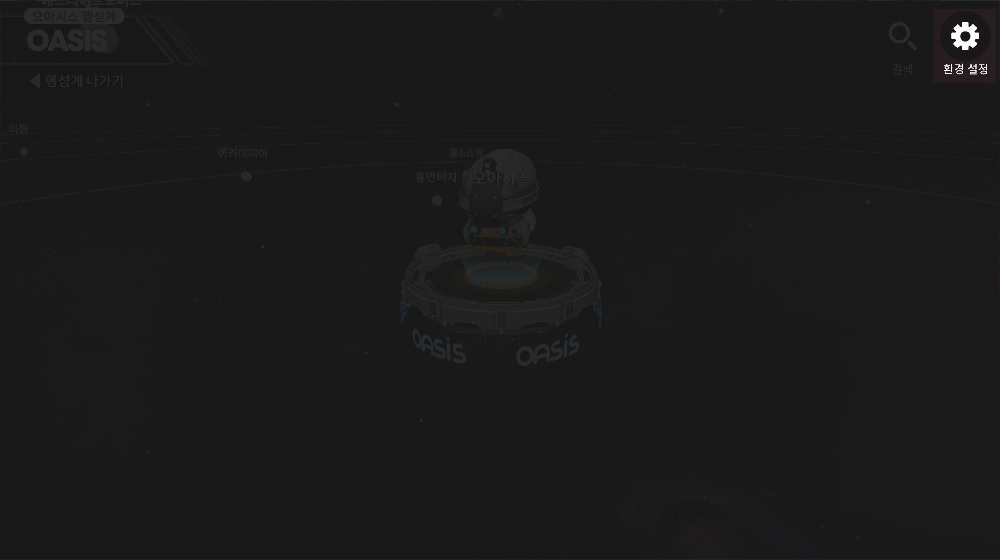
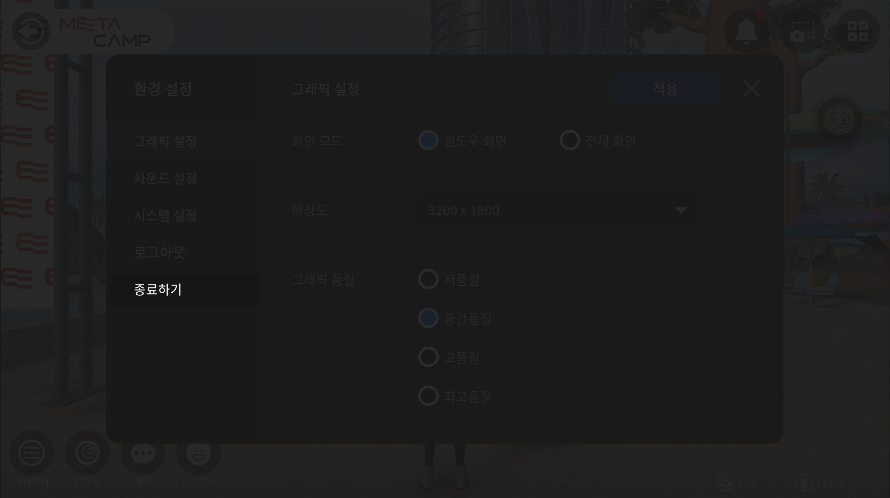
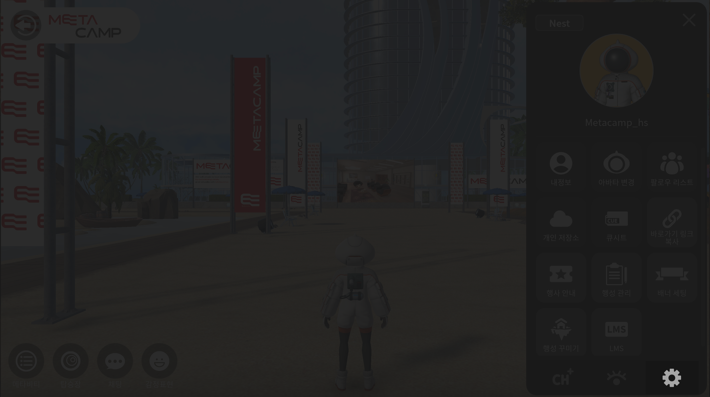

# 종료하기

## 행성계 및 로그인 화면에서 종료하는 방법

<figure><figcaption></figcaption></figure>

<figure><figcaption></figcaption></figure>

1. 환경설정 버튼을 눌러주세요&#x20;
2. 왼쪽 하단 탭에서 종료하기 버튼을 눌러주세요
3. 확인버튼을 눌러주세요

## 플레이 화면 내부에서 종료하는 방법

<figure><figcaption>
메뉴버튼을 누른 후 설정아이콘을 눌러주세요
</figcaption></figure>

<figure><figcaption>
왼쪽 탭 종료하기 버튼을 눌러주세요
</figcaption></figure>

1. 오른쪽 상단 메뉴버튼을 눌러주세요
2. 오른쪽 하단 설정 아이콘을 눌러주세요
3. 환경설정 창이 뜨면 왼쪽 종료하기 탭을 눌러주세요
4. 확인버튼을 눌러주세요&#x20;

