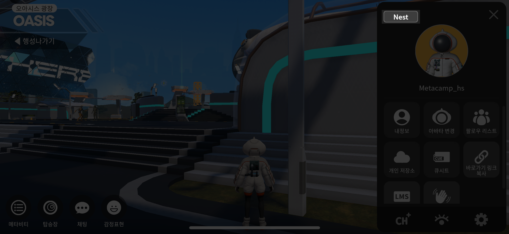
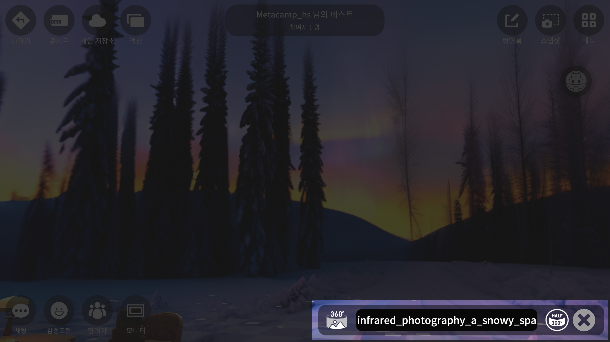

# 네스트

<figure><figcaption></figcaption></figure>

1. 오른쪽 상단 **메뉴 버튼**을 눌러주세요
2. 메뉴의 왼쪽 상단 **네스트 버튼**을 눌러주세요

***

## 네스트 기능 사용하기

<figure><figcaption></figcaption></figure>

1. **나가기**   해당 공간을 나갈 때 사용합니다
2. **큐시트** 개인의 큐시트를 지정 할 수 있습니다&#x20;
3. **개인저장소** 이미지, 영상, 파일, 큐시트 등을 저장하여 사용할 수 있습니다&#x20;
4. **액션**  네스트에서 운영자가 필요한 액션을 작동 할 수 있습니다&#x20;


**TIP** 360이미지를 배경으로 사용하시면, 야외 공간으로 변경하여 커뮤니케이션을 즐길 수 있습니다


<figure><figcaption></figcaption></figure>

<figure><figcaption>
배경을 없애고 싶으신 경우, X버튼을 눌러 사용하세요
</figcaption></figure>

5. **참여자 창**  현재 아지트 위치와, 참여자가 몇명인지 알려주는 창입니다&#x20;
6. **방명록**  해당 아지트에서 방명록을 남길 수 있습니다&#x20;
7. **스냅샷**  현재 사용자가 보고 있는 화면을 캡쳐하여 저장 할 수 있습니다&#x20;

<figure><figcaption>
<mark style="color:blue;"><strong>0 : 타이머를 설정 할 수 있습니다 ( 0, 3, 5초)        카메라 : 촬영 버튼         눈 : UI 점멸 버튼         X : 스냅샷 끄기 버튼</strong></mark>
</figcaption></figure>

