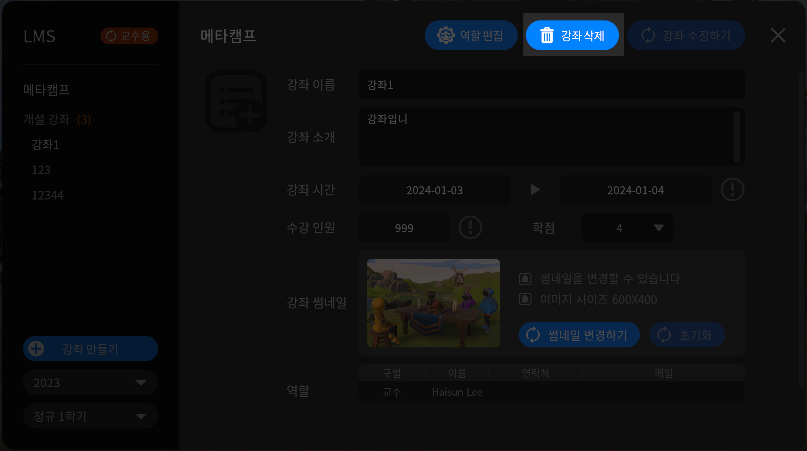

# 강의, 강좌 제거하기


강좌 삭제 전, 강의가 생성 되어 있는 경우 강좌 삭제가 불가하오니 강좌 내 강의를 먼저 삭제해 주시기 바랍니다


## 강좌 삭제하기&#x20;

<figure><figcaption></figcaption></figure>

1. 오른쪽 상단 **강좌정보** 버튼을 눌러주세요
2. 새창에서 **강좌삭제** 버튼을 눌러주세요

## 강의 삭제하기


삭제 한 강의는 복구가 불가하오니, 신중하게 결정하여 삭제를 진행해주세요&#x20;


<figure><figcaption></figcaption></figure>

1. **삭제 할 강의를 선택**해주세요&#x20;
2. 네번째 **삭제하기** 버튼을 눌러주세요

