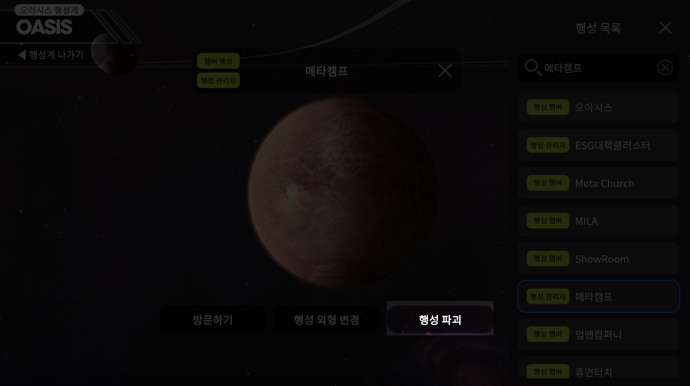

# 행성 제거하기


행성을 파괴하면 행성 내 모든 데이터가 삭제되며, 복구할 수 없습니다 신중하게 결정해주세요


<figure><figcaption>
행성계 진입 후, 관리자인 <mark style="color:blue;"><strong>행성</strong></mark>을 눌러주세요  
</figcaption></figure>

<figure><figcaption></figcaption></figure>

1. 세번째 **행성 파괴** 버튼을 눌러주세요
2. **확인** 버튼을 눌러주세요&#x20;
