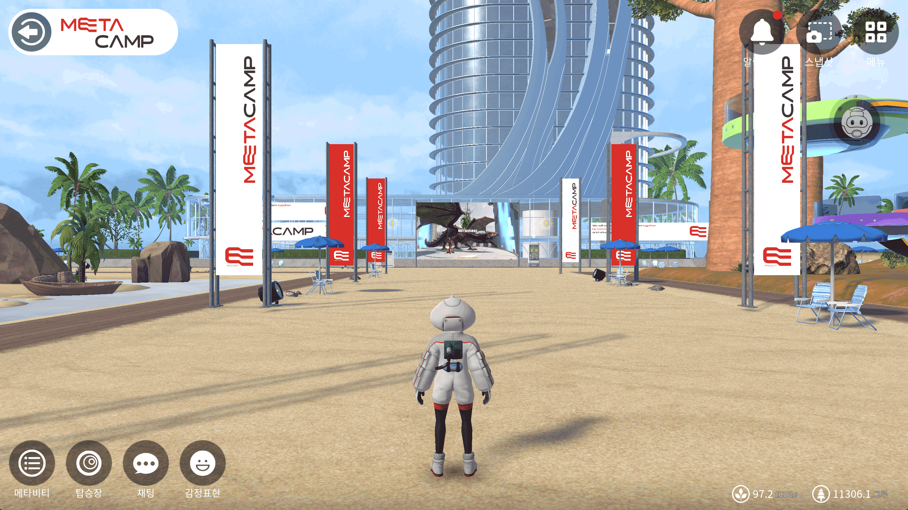

# 행성 정보 설정

<figure><figcaption></figcaption></figure>

## 행성 위치정보 설정

행성 정보 하단에 변경버튼을 누르시면, 행성 정보가 변경됩니다

이 행성 정보를 설정하시면 행성소개 메인에 실제 좌표값 표시가 됩니다

##

## 행성 정보설정


위치정보를 적용할 경우, ESG 절감 데이터를 받아 보실 수 있습니다&#x20;


1. **메뉴버튼**을 눌러주세요
2. **행성관리 버튼**을 눌러주세요
3. 왼쪽 행성정보 탭을 눌러주세요

## 행성의 밤낮 시간을 적용

4. 행성의 밤낮 시간을 적용하여, 행성 내부 배경테마를 적용 할 수 있습니다

<figure><figcaption></figcaption></figure>

##

***

## 행성 유형설정 (자유행성, 오픈행성, 멤버행성, 비밀행성)

<figure><figcaption></figcaption></figure>

THERE의 행성유형은 4가지 유형이 있습니다 메타버시티 행성계의 행성은 모두 멤버행성으로 이루어져 있습니다

오아시스 행성계의 경우 행성관리 자가 행성유형을 자유롭게 변경할 수 있습니다.

* **자유행성** 홍보, 전시 등의 메타비티를 제공할 목적을 가지는 행성입니다 (회원 가입을 받지 않는 행성)
* **오픈행성** 불특정 다수에게 강의, 세미나, 컨퍼런스 등의 메타비티를 제공할 목적을 가진 행성 (회원가입이 자유로우며, 가입신청 즉시 승인절차 없이 가입 완료)
* **멤버행성** 학교, 학원, 회사 등 회원을 대상으로 협업, 강의 등의 메타비티를 진행하는 것이 목적인 행성 (**멤버가입은 관리자의 승인이 필요** 일반 유저(비회원)도 초대링크를 활용하여 전체공개 메타비티에 참여가능 **메타버시티 행성계의 행성은 모두 멤버행성**
* **시크릿행성** 비공개 멤버십 행성의 개념입니다. 확인된 회원을 대상으로 비공개 메타비티를 제공하는 행성으로 멤버(회원)가 아니면 행성진입이 불가능가입은 관리자의 승인이 필요&#x20;

##
