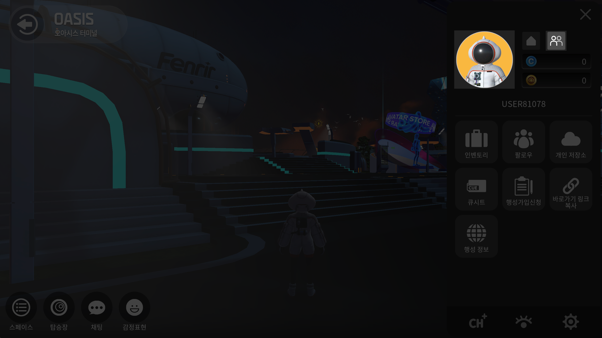
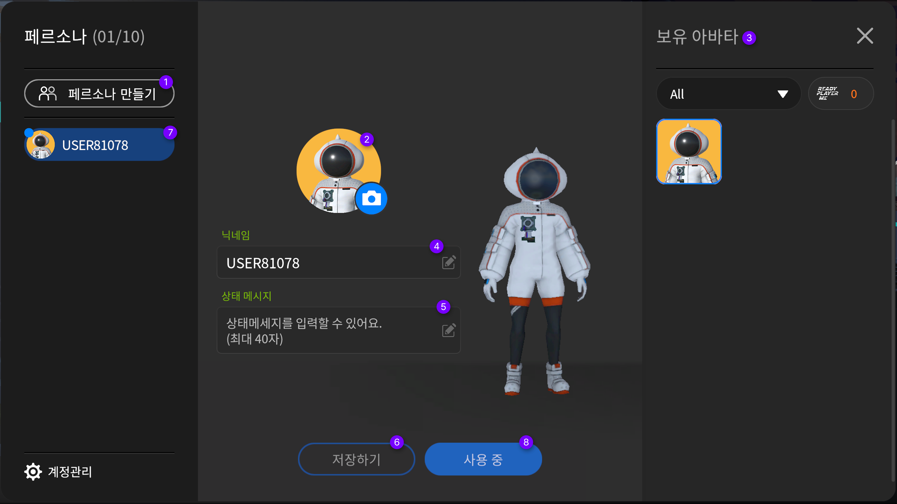
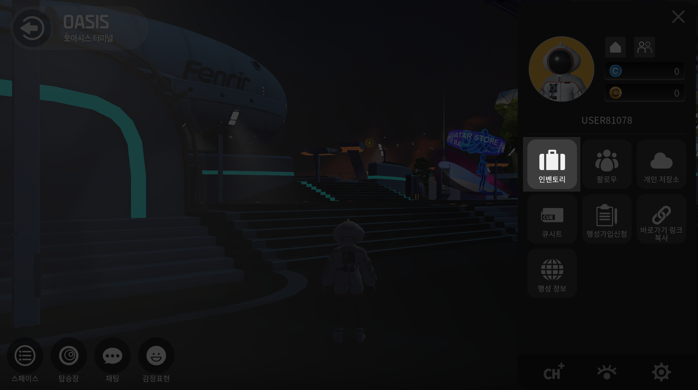
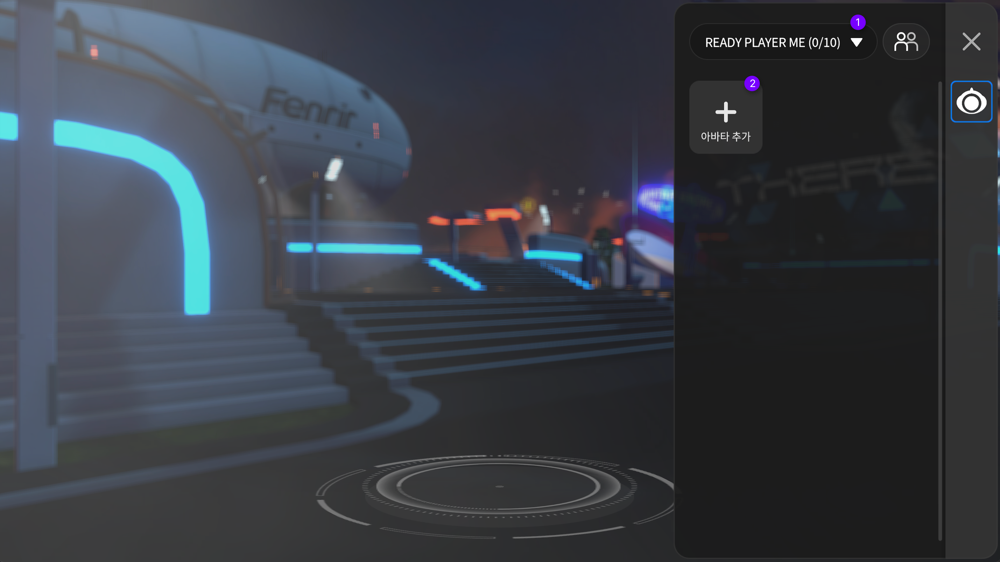
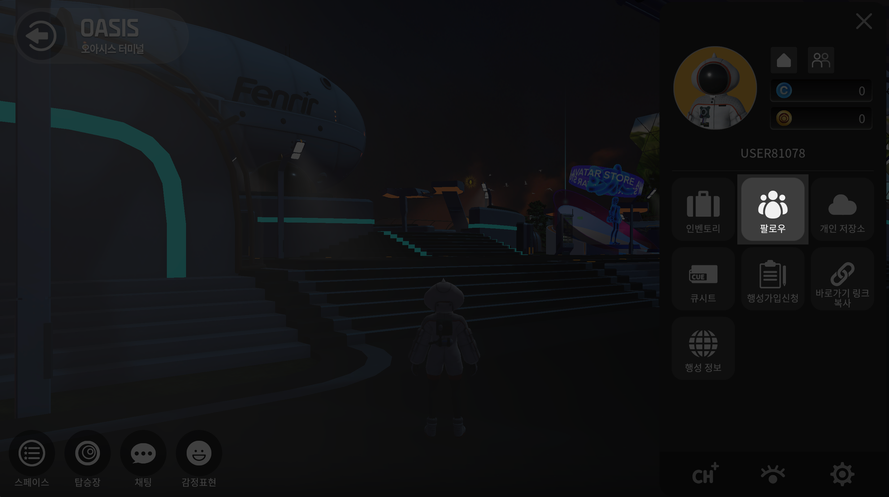

# 사용자 설정

## 내정보 수정하기

<figure><figcaption></figcaption></figure>

1. **메뉴버튼**을 눌러주세요
2. **프로필 아이콘 혹은 멀티페르소나 버튼**을 눌러주세요
3. 오른쪽하단의 계정관리 버튼을 눌러주세요&#x20;

<figure><figcaption></figcaption></figure>

&#x20; 3\. 변경하고자 하는 항목의 **변경버튼**을 눌러주세요

4. 입력 후, 활성화 된 **변경하기 버튼**을 눌러주세요

## **추가정보 수정하기**


사이트와 SNS의 전체 url을 기재해주세요&#x20;

예시)

[https://there.space\
](https://www.there.spacehttps/www.instagram.com/there\_space)[https://instagram.com/there\_space](https://www.there.spacehttps/www.instagram.com/there\_space)

https://blog.naver.com/there\_spce


1. **메뉴버튼**을 눌러주세요
2. **내정보 버튼**을 눌러주세요
3. 왼쪽의 **추가정보 탭**을 눌러주세요
4. 변경하고자 하는 항목의 **변경버튼**을 눌러주세요
5. 입력 후, **Enter키**를 눌러 변경해주세요

## 멀티 페르소나 설정하기

1. **메뉴버튼**을 눌러주세요
2. **프로필 아이콘 혹은 멀티페르소나 버튼**을 눌러주세요
3. **페르소나** 창에서 설정을 진행해주세요&#x20;

<figure><figcaption></figcaption></figure>

1. **페르소나 만들기** 버튼을 눌러주세요
2. **아바타 썸네일 설정하기** 해당 페르소나 아바타 썸네일을 설정할 수 있습니다&#x20;
3. **보유 아바타 목록** 아바타의 목록 확인 후, 원하는 아바타를 선택해주세요&#x20;
4. **닉네임설정하기** 플레이 할 닉네임을 입력해주세요&#x20;
5. **상태 메세지 설정하기** 플레이 할 상태메세지를 입력해주세요&#x20;
6. **저장하기** 저장하기 버튼을 눌러주세요&#x20;
7. **페르소나 목록** 왼쪽 페르소나 목록을 확인 해 원하는 페르소나 아바타를 선택해주세요 &#x20;
8. **사용하기 버튼** 사용하기 버튼을 눌러주세요 / 버튼을 누른 후, 사용중으로 자동 변경됩니다&#x20;

## **레디플레이어미 아바타 등록하기**

메뉴 > 인벤토리 버튼을 눌러주세요&#x20;

<figure><figcaption></figcaption></figure>

### **레디플레이어미 인벤토리 설정하기**

<figure><figcaption></figcaption></figure>

1. 인벤토리에서 **오른쪽 상단 항목설정 버튼에서 레디플레이어미 버튼**을 선택해주세요
2. **아바타추가 버튼**을 선택해주세요
3. 레디플레이어미 **링크 붙여넣기를 진행**해주세요
4. **적용하기 버튼**을 눌러주세요&#x20;

### **레디플레이어미 인벤토리에서 삭제하기**

<figure><figcaption></figcaption></figure>

1. 인벤토리에서 **오른쪽 상단 항목설정 버튼에서 레디플레이어미 버튼**을 선택해주세요
2. **삭제할 아바타 버튼**을 눌러주세요
3. 아바타 **오른쪽 상단의 빨간색 - 버튼**을 눌러주세요

## 팔로우 리스트 관리

<figure><figcaption></figcaption></figure>

<figure><figcaption></figcaption></figure>

1. 메뉴 > 팔로우 리스트 버튼을 눌러주세요&#x20;
2. 친구를 추가하고, 그룹화 하여 관리할 수 있으며 귓속말을 전달하고 내가 있는 공간으로 초대할 수도 있습니다&#x20;

