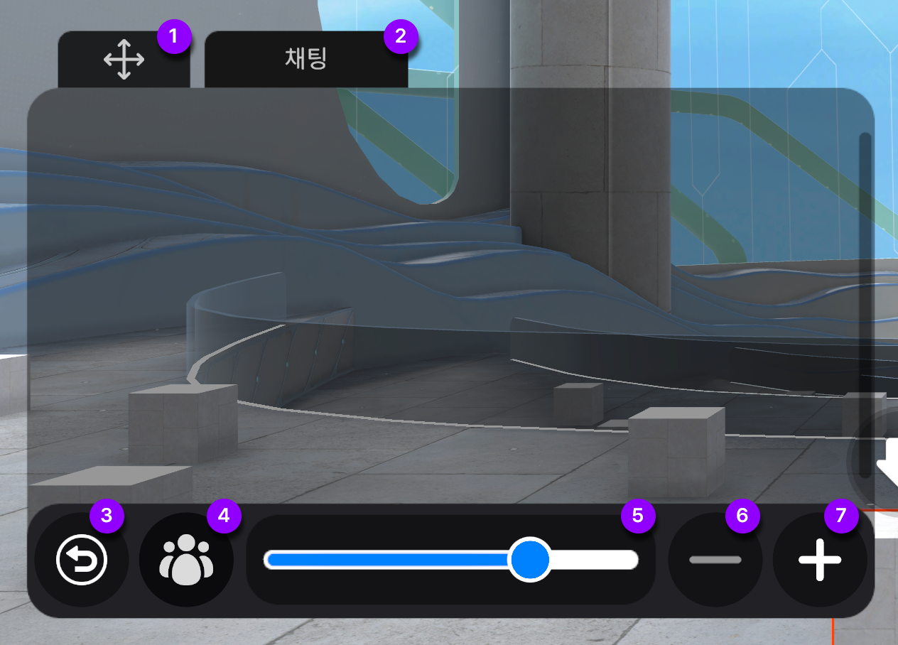

# 채팅

## 채팅창 메뉴안내&#x20;

<figure><figcaption>
1
</figcaption></figure>

1. **이동툴** 채팅창을 원하는 위치로 이동시켜 사용해보세요&#x20;
2. **채팅탭** 채팅창을 보여줍니다&#x20;
3. **THERE AI Agent 탭** Chat GPT와 연동된 채팅창을 보여줍니다
4. **설정** 채팅창의 설정을 변경 할 수 있습니다 [( 참고 ) ](undefined.md#undefined-1)
5. **입력창** 내용을 입력할 수 있습니다&#x20;

### 설정버튼 메뉴안내

<figure><figcaption></figcaption></figure>

1. **이동툴** 채팅창을 원하는 위치로 이동시켜 사용해보세요&#x20;
2. **채팅탭** 채팅창을 보여줍니다&#x20;
3. **이전버튼** 이전화면으로 전환됩니다&#x20;
4. **참여자버튼**  참여자리스트를 확인할 수 있습니다&#x20;
5. **투명도창** 채팅창의 투명도를 설정 할 수 있습니다&#x20;
6. 채팅창 사이즈 축소 버튼 입니다
7. 채팅창 사이즈 확대 버튼 입니다&#x20;

## 기본 사용 명령어

채팅창에 해당 명령어를 입력하면 손쉬운 이용이 가능합니다&#x20;

### 귓속말 보내기


입력된 아이디의 유저가 없으면 귓속말 모드로 전환되지 않습니다

해당 아이디의 유저가 접속중이 아니면 귓속말이 불가합니다&#x20;


1. **'@유저아이디'** 해당 유저에게 귓속말 보내는 명령어 입니다&#x20;
2. **'/r'**  귓속말을 수신받았을 경우, 수신 받은 상대에게 귓속말을 회신할 수 있습니다
3. 채팅창에서 유저의 아이디를 누르면 귓속말 모드로 자동 전환됩니다
4. 채팅창 옵션버튼을 누르고, 유저 아이콘을 클릭하면 유저 리스트를 확인 할 수 있습니다. 유저 리스트중 원하는 유저를 눌러 귓속말 모드로 전환 할 수 있습니다

**귓속말 모드 종료하기**&#x20;

1. 귓속말 모드에서 닫기 버튼을 눌러주세요 &#x20;
2. 윈도우와 Mac의 경우 ESC 키를 눌러서 귓속말 모드를 종료 할 수 있습니다&#x20;

## Chat GPT

1. 화면 오른쪽에 Chat GPT 버튼을 눌러 활성화 할 수 있습니다&#x20;
2. 채팅창에 **‘@gpt’** 를 입력한 후 스페이스를 누르면 ChatGPT 기능이 활성화 됩니다
3. 설정 > 참여자 버튼에서 there AI 참여자를 누르면 ChatGPT 기능이 활성화 됩니다

