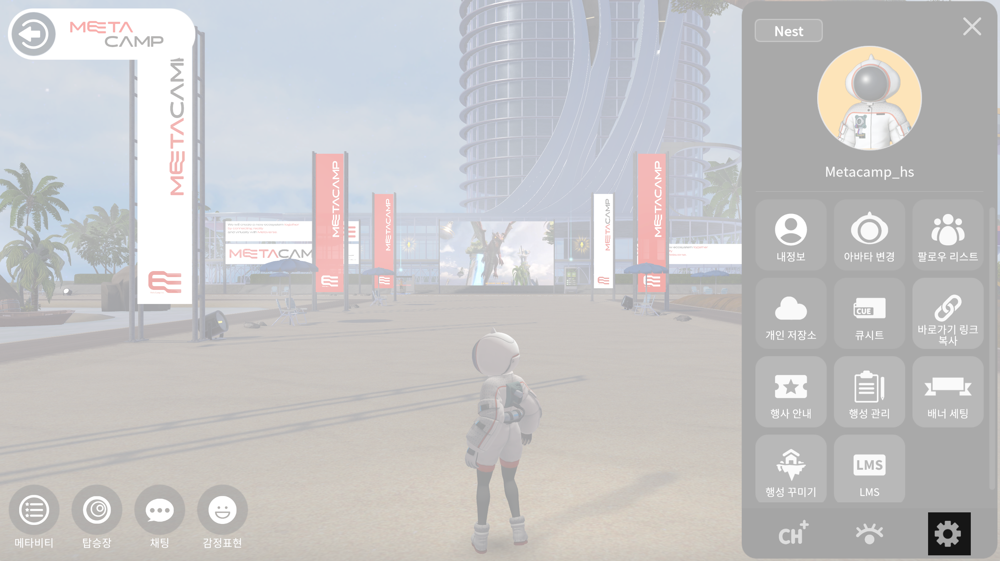

# ⚙ 환경설정

<figure><figcaption></figcaption></figure>

플레이 화면의 오른쪽 하단 설정버튼을 눌러주세요&#x20;

## 그래픽설정

<figure><figcaption></figcaption></figure>

* 윈도우화면 :  추가 창화면으로 플레이 할 수 있습니다
* 전체화면 : 전체 풀화면으로 플레이 할 수 있습니다
* 해상도 : 원하는 해상도로 설정하여 플레이 할 수 있습니다 ( \* 해상도 사양은 디바이스에 따라 설정값이 다를 수 있습니다)&#x20;
* 그래픽 품질 : 그래픽 품질을 설정할 수 있습니다 ( 고품질, 최고품질 사양은 시인성은 좋으나 오랜시간 플레이 하는 경우 저품질이나 중간품질을 추천합니다  )

##

## 사운드설정


상대방의 목소리나 방송하고 있는 소리가 잘 들리지 않는 경우 사운드 설정을 확인해주세요&#x20;


<figure><figcaption></figcaption></figure>

* 전체볼륨 :  플레이 화면의 전체 볼륨을 조절할 수 있습니다&#x20;
* 배경음 : 배경음악의 볼륨을 조절할 수 있습니다&#x20;
* 효과음 : 선택음이나 설정음의 볼륨을 조절 할 수 있습니다&#x20;

##

## 시스템설정


현재 언어지원은 한국어와 영어만 가능합니다. 다양한 국가의 언어호환을 진행중입니다&#x20;


<figure><figcaption></figcaption></figure>

* 닉네임표시 : 플레이화면의 닉네임 표시사항을 on/off 할 수 있습니다
* 이름표시 순서 : 글로벌 표기를 위해 이름을 표기 설정 할 수 있습니다&#x20;
* 시스템 메세지 : 시스템 메세지를 알림 받을 때, 문자나 이메일로 받을 수 있고 중복설정도 가능합니다 &#x20;

##

## 로그아웃

로그아웃 버튼을 누른 후, 확인버튼을 누르면 로그아웃 할 수 있습니다.&#x20;

로그아웃 시, 로그인 화면으로 돌아갑니다&#x20;

##

## 종료하기

종료 버튼을 누른 후, 종료 버튼을 누르면 로그아웃 할 수 있습니다.&#x20;
