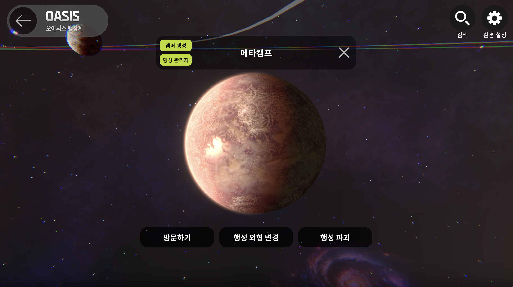
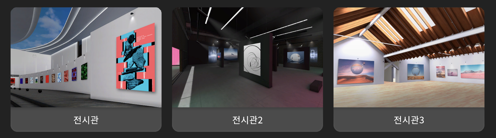

# 명칭 소개

THERE는 각각의 기관을 행성으로 구분합니다

행성이 모여 행성계를 이루고 행성계의 센터에는 각 광장이 위치합니다

이 광장에서는 다양한 코워킹과 네트워킹이 가능하며 커뮤니케이션을 기반으로 이루어져 있습니다

***

## 행성계

행성계에 진입하면, 각 기관 및 시설이 행성명으로 지정되어 있습니다

<figure><figcaption></figcaption></figure>

<figure><figcaption></figcaption></figure>

 

<figure><figcaption></figcaption></figure>

* 메타버시티 (메타버시티 2.0) : 국내 60여개의 대학교가 모여 있는 행성계입니다
* 오아시스 : 국내 기업및 기관들이 모여있는 행성계입니다

***

## 행성


**행성과 메타비티의 가장 큰 차이점은 참여인원수와 운영 기간의 제한 유무입니다**


<figure><figcaption></figcaption></figure>

* 행성과 메타비티의 차이점 행성은 3D 공간 기반의 인터넷 서비스입니다
* 행성은 가상공간에서 커뮤니케이션 할 수 있는 커뮤니티입니다
* 행성은 참여 인원과 기간 제한이 없는 커뮤니케이션 공간입니다

***

## 스페이스&#x20;


스페이스는 행성에서 진행되는 이벤트 개념의 커뮤니케이션 공간입니다

스페이스는 기간과 인원수에 제한이 있습니다

원하는 테마에 맞게 공간을 만들어 상대를 골라 초대할 수 도 있고 자료나 정보를 나눌 수도 있습니다


<figure><figcaption></figcaption></figure>

* **실시간강의실 \_7개 테마( 야외1, 실내 6 ) :** 7개의 테마로 구성되어있는 실시간 강의실에서는 강의를 라이브로 진행 할 수 있습니다
* **VOD 강의 \_ 7개 테마( 야외1, 실내 6 ) :** 7개의 테마로 구성되어있는 VOD 강의실에서는 동영상 강의 및 자료 강의를 저장하여 진행 할 수 있습니다

* **행사장\_7개 테마**

1. 콘서트장(야외) : 스크린이 2개로 구성되어 있으며, 콘서트 및 다양한 행사 진행이 가능합니다
2. 행사장A, B, C (야외) : 스크린이 1개로 구성되어 있으며, 다양한 행사 진행이 가능합니다
3. 전시관1, 2, 3 (실내3종)

<figure><figcaption></figcaption></figure>

* [ ] 전시관 1 : 전시품 108개
* [ ] 전시관 2 : 전시품 24개
* [ ] 전시관 3 : 전시품 38개

<!---->

* **컨퍼런스\_5개 테마 ( 야외 2, 실내 3) :** 대규모 컨퍼런스및 행사를 진행 할 수 있습니다
* **회의실\_1개 테마 (실내1) :** 15명 미만의 회의 모임을 진행 할 수 있습니다
* **동호회\_1개 테마 (실내 1) :** 10명 미만의 소규모 모임을 진행 할 수 있습니다
* **상담실\_1개 테마 (야외 1) :** 일대일 상담을 진행 할 수 있습니다

***

## 탑승장

행성계로 이동이 가능하며, 링크를 이용하여 바로이동이 가능합니다


바로가기 링크주소 복사 후 이용자에게 공유하면 바로 접속이 가능합니다&#x20;

\*앱 다운로드 및 회원가입이 진행 되었을 경우에 해당됩니다&#x20;


<figure><figcaption></figcaption></figure>

1. 플레이 화면에서 왼쪽 하단 두번째 **탑승장** 버튼을 눌러주세요
2. **링크로 바로가기** 버튼을 눌러주세요
3. **링크를 입력**해주세요&#x20;

