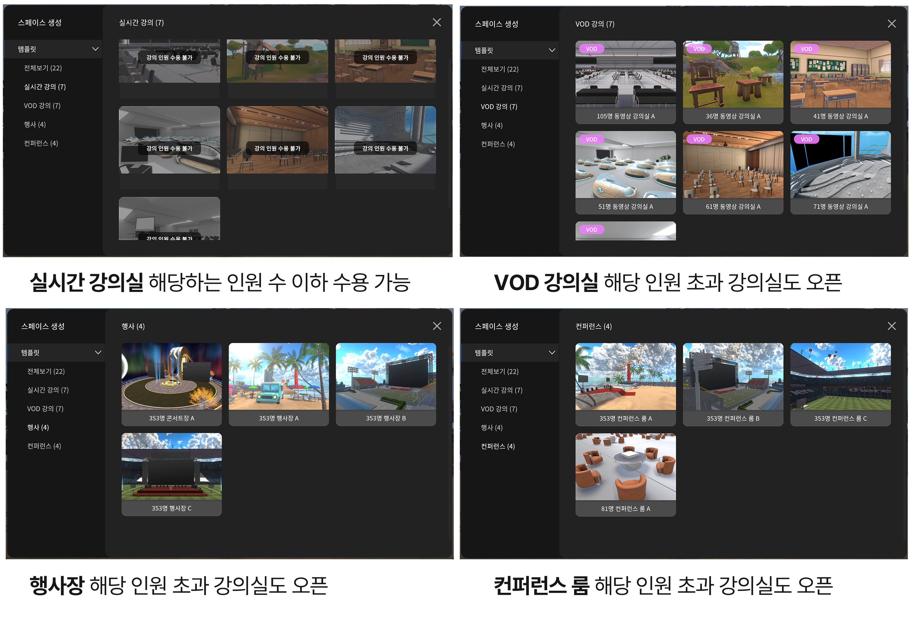

# LMS 운영안내

강좌를 만든 후, 그에 해당하는 강의를 다양하게 개설 할 수 있습니다&#x20;

## 강좌 및 강의 개설


<mark style="color:red;">꼭 읽어주세요!!!! 강좌 및 강의 오픈일 이후 강좌 및 강의 수정이 불가합니다</mark>&#x20;



강의실 인원은 강좌 수강인원 설정에 맞게 지정 할 수 있습니다&#x20;

실시간 강의실은 강의실 명에 기재되어 있는 인원 수 대로 구성 할 수 있습니다&#x20;

VOD강의실과 컨퍼런스는 무한인원 접속이 가능하며, 기재되어 있는  인원수 별로 그룹으로 묶여( 채널시스템 ) 화면에 송출 됩니다&#x20;



운영자 아이디에 해당하는 강좌만 보여집니다 ( 본인이 생성한 강의만 볼 수 있습니다 )


예시 )  1. 강좌인원 400명 설정 시&#x20;

실시간 강의 수용인원 초과 입장 불가, VOD 강의 수용인원 초과 입장가능, 행사 및 컨퍼런스 수용인원 초과  입장가능

<figure><figcaption></figcaption></figure>

##

***

## 강좌 신청받기&#x20;

신청자를 받기 위해 강좌 신청받기 버튼을 이용하세요&#x20;

<figure><figcaption></figcaption></figure>

##

***

## 강의 설정하기

<figure><figcaption></figcaption></figure>

1. 생성한 강의를 선택해주세요&#x20;
2. 목록의 세번째 **상세보기 및 수정** 버튼을 눌러주세요 &#x20;

## A. 담당 교수 변경

담당교수를 변경할수 있습니다&#x20;

1. **변경하기 버튼**을 눌러주세요&#x20;
2. 변경할 교수의 아이디를 입력해주세요&#x20;

## B. 학습자료 업로드

학습자료를 등록할 수 있습니다&#x20;


PDF, JPG, PNG, MP3, MP4 파일 형식을 업로드 할 수 있습니다&#x20;


1. 학습자료 영역의 **자료등록 버튼**을 눌러주세요&#x20;
2. **로컬파일, 나의저장**소 에 있는 자료를 불러오세요&#x20;

## C. 출석 및 과제관리&#x20;

출석관리와 과제관리를 설정 할수 있습니다

### 출석관리 &#x20;

1. **학습등록 버튼**을 눌러주세요&#x20;
2. 드롭다운 메뉴바에서 원하는 출석 확인 설정을 선택해주세요&#x20;

* **10뷴 후 자동 처리** 수업 진행 10분 후 자동 출석체크가 되는 기능입니다&#x20;
* **종료 시 자동 처리** 수업 종료 후 접속자에 한하여 자동 출석체크가 되는 기능입니다&#x20;
* **직접호명** 직접 참여자를 확인하여 출석체크 하는 기능입니다&#x20;

### 과제관리


수강자는 한개의 과제만 제출 할 수 있습니다 여러개의 파일을 업로드 할 경우 압축하여 제출해주세요&#x20;


1. 과제 제출 on/off 버튼으로 지정해주세요 &#x20;
2. 공개일시와 마감일시를 지정해주세요&#x20;
3. 과제제목과 과제설명을 입력해주세요&#x20;
