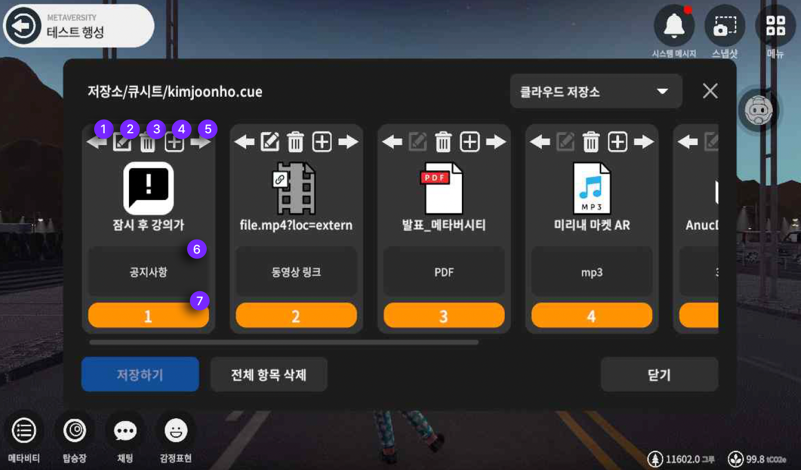
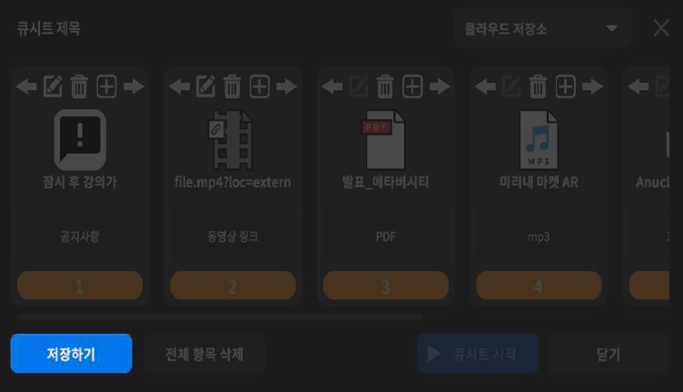
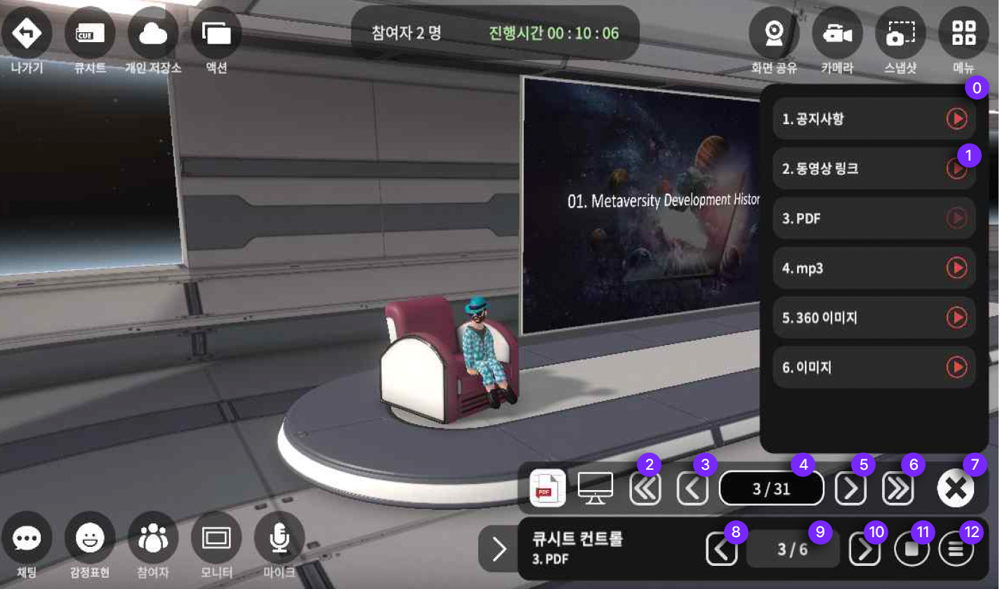

# 큐시트

## 큐시트 메뉴안내

<figure><figcaption></figcaption></figure>

1. **왼쪽으로 액션을 이동하는 버튼**입니다
2. **큐시트 내용 수정버튼**입니다. 공지사항 문구, 동영상 링크를 수정할 수 있습니다.
3. **큐시트를 제거 할 수 있는 버튼**입니다&#x20;
4. **큐시트를 추가할 수 있는 버튼**입니다&#x20;
5. **오른쪽으로 해당 큐가 이동하는 버튼**입니다&#x20;
6. **액션의 제목을 알려주는 창** 입니다
7. **액션 순서를 알려주는 창** 입니다&#x20;


큐시트에 포함되는 자료는 PDF, 동영상 링크, 음악파일(mp3), 이미지파일(png, jpg), 공지사항,&#x20;

공지사항(링크), 360도 이미지입니다. **동영상파일은 지원하지 않습니다.**





한번 설정한 큐시트를는 개인저장소에 저장하여 지속적으로 사용 할 수 있습니다&#x20;


1. 메타비티나 [Nest](undefined-1.md)에 진입합니다
2. 왼쪽 상단 두번째 <mark style="color:blue;">**큐시트**</mark>를 눌러주세요
3. 큐시트의 <mark style="color:blue;">**+ 버튼**</mark>을 눌러 이용하고 싶으신 액션을 선택해주세요 (큐시트 액션의 제목을 삽입 합니다.  순서 변경 시 항목의 내용이 기억나지 않을 수 있으니, 제목 삽입을 추천 드립니다.)
4. 큐시트의 설정도 변경 할 수 있습니다 ( 상단 메뉴설명 참고 )&#x20;
5. 큐시트를 시작 한 후 <mark style="color:blue;">**컨트롤러**</mark>를 이용하여 간편하게 사용도 가능하고, 디테일한 <mark style="color:blue;">**목록**</mark>을 통해 큐시트를 편리하게 작동 시킬 수 있습니다 (하단 컨트롤러 설명 참고)

## 큐시트 저장하기&#x20;

<figure><figcaption></figcaption></figure>

큐시트를 모두 설정 한 후,  저장하기 버튼을 누르면 [개인저장소](undefined-2.md)에 저장할 수 있습니다&#x20;

저장한 큐시트는 메타비티와 NEST에서 큐시트 불러오기 기능을 통해 편리하게 재 사용이 가능합니다&#x20;

## 큐시트 불러오기

<figure><figcaption></figcaption></figure>

1. 큐시트를 사용할 공간으로 진입해주세요
2. 왼쪽 상단 두번째 큐시트 버튼을 눌러주세요
3. 창의 오른쪽 상단 클라우드 저장소 옆 화살표 버튼을 눌러주세요
4. 불러오기 버튼을 눌러주세요
5. 큐시트를 저장해놓은 폴더에서 해당 큐시트를 찾아 적용해주세요

## 컨트롤러 안내

<figure><figcaption></figcaption></figure>

0\. **큐시트 패널**입니다. 어떤 액션이 있는지 목록을 보여줍니다&#x20;

1.해당 액션을 작동시키는 **작동버튼**입니다

2.현재 작동되는 **액션의 첫페이지로 가는 버튼**입니다

3.현재 작동되는 **액션의 전 페이지로 돌아가는 버튼**입니다&#x20;

4.현재 작동되는 액션의 순서를 알려주는 창입니다&#x20;

5.현재 작동되는 **액션의 다음 단계로 돌아가는 버튼**입니다&#x20;

6.**액션의 끝 순서로 가는 버튼**입니다&#x20;

7.현재 **액션를 종료하는 버튼**입니다&#x20;

8.현재 **큐시트의 전단계로 가는 버튼**입니다&#x20;

9.현재 **큐시트의 순서를 알려주는 창**입니다&#x20;

10.현재 **큐시트의 다음단계로 가는 버튼**입니다&#x20;

11.**큐시트를 멈추는 버튼**입니다&#x20;

12.**큐시트의 목록을 on/off 할 수 있는 버튼**입니다&#x20;

