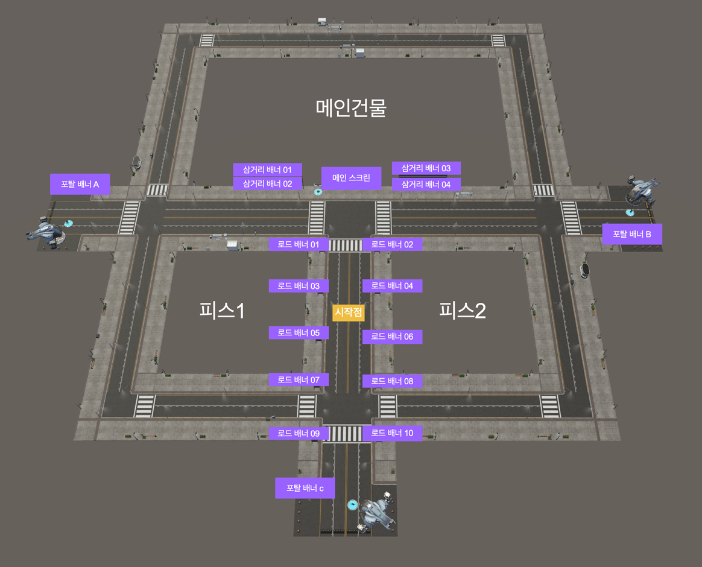

# 행성 내 배너 만들기

<figure><figcaption>
배너 위치 안내도
</figcaption></figure>

## 배너 꾸미기


배너를 누르면, 이미지 사이즈가 기재되어 있습니다. 해당 사이즈로 적용 이미지를 준비해주세요

가로배너 : 2048x307 / 세로배너 : 410x2048&#x20;




1. <mark style="color:blue;">**메뉴버튼**</mark>을 눌러주세요
2. <mark style="color:blue;">**배너 꾸미기 버튼**</mark>을 눌러주세요
3. 원하는 위치의 배너를 눌러주세요 (\*상단의 배너 위치 안내도 참조)
4. <mark style="color:blue;">**+버튼**</mark>을 눌러주세요
5. &#x20;준비한 이미지를 목록에서 찾아주세요
6. <mark style="color:blue;">**선택 버튼**</mark>을 눌러주세요&#x20;
7. 교체주기를 지정해주세요 적용시 해당 지정한 N초 이후에 점멸 후, 배너가 전환됩니다

**\*배너복제 기능** 모든 이미지를 적용하지 않아도 기존에 적용 한 배너를 복제해서 사용 할 수 있습니다&#x20;

&#x20;
