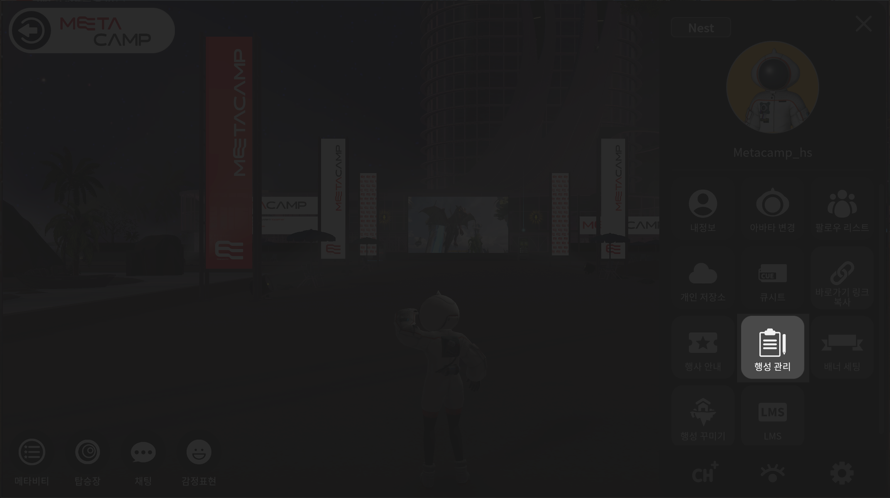

# 행성 시스템설정

행성 정보, 행성멤버 관리, 멤버등급설정, 가입신청자 관리, 가입설정이 가능합니다

<figure><figcaption></figcaption></figure>

1. 오른쪽 상단의 <mark style="color:blue;">**메뉴버튼**</mark>을 눌러주세요
2. <mark style="color:blue;">**행성관리 버튼**</mark>을 눌러주세요

