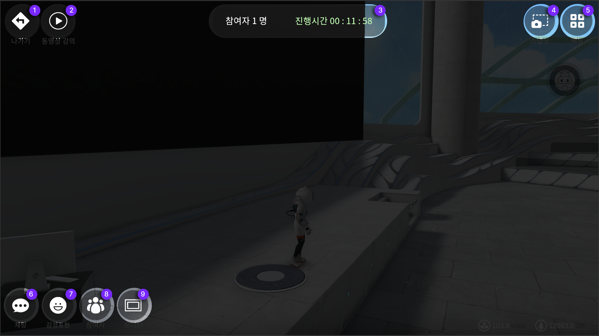

# 메타비티 운영안내


<mark style="color:blue;">**메타비티의 특성마다 기능이 다르기 때문에 모든 메뉴가 구성되어 있지 않으니 각 항목을 확인 후,**</mark>&#x20;

<mark style="color:blue;">**목적에 맞는 메타비티를 생성해주시면 됩니다**</mark>&#x20;



메타비티를 생성 후에 운영할 수 있는 화면설명입니다.

메타비티를 먼저 생성해주세요 [메타비티 만들기](undefined/)를 참고해주세요


## 메타비티 진입 후, 운영용 메뉴설명

<figure><figcaption></figcaption></figure>

1. **나가기** 메타비티 나가기버튼입니다
2. **큐시트** 메타비티에서 사용할 큐시트 작동 버튼입니다&#x20;
3. **개인저장소** 개인의 저장소에서 내용을 불러 올 수 있는 버튼입니다&#x20;
4. **액션** 해당 메타비티에서 운영할 수 있는 액션리스트 버튼입니다
5. **메타비티** 안내 창 참여자와 진행시간을 확인 할 수 있는 창입니다&#x20;
6. **방명록** 해당 메타비티의 방명록을 확인 할 수 있는 버튼입니다
7. **화면공유** 운영자가 참여자에게 화면공유를 위한 버튼입니다 운영자만 내 디바이스의 화면 및 카메라를 참여자들에게 공유를 할 수 있습니다&#x20;
8. **카메라** 현재 아바타의 위치를 기준으로 작동되지만, 아바타의 시점이 아닌 전체 화면의 시점으로 카메라 뷰를 설정할 수 있는 버튼입니다
9. **스냅샷** 내 환경과 플레이 화면을 촬영 할 때 사용 할 수 있습니다
10. **메뉴** 메뉴창을 볼 수 있습니다
11. **채팅** 현재 위치해 있는 공간의 채팅창입니다
12. **감정표현** 아바타의 모션으로 감정표현이 가능합니다
13. **참여자** 참여자의 현황과 리스트 및 설정이 가능한 버튼입니다&#x20;
14. **모니터** 송출할 내용의 모니터를 기준으로 확대와 판서기능이 가능한 버튼입니다&#x20;
15. **마이크** 해당 메타비티 내에서 소통 할 수 있는 음성용 on/off기능의 버튼입니다&#x20;

## 상세 기능 이용 안내&#x20;

### **액션 내 메뉴 이용안내**&#x20;


파일을 불러올 때, 경로를 잃어버리셨다면 메타비티에서 나간 후 재 접속하시면 경로가 재 셋팅됩니다


**PDF 파일** 파일을 화면에 공유하여 설명할 수 있습니다&#x20;

<figure><figcaption>
PDF 공유화면 입니다 오른쪽 하단 컨트롤러를 사용하실 수 있습니다
</figcaption></figure>

**동영상링크** 유튜브나 비메오의 링크를 복사하여 공유하며 설명할 수 있습니다&#x20;

유튜브 링크 복사 방법&#x20;

비메오 링크 복사방법&#x20;

**음악파일** 메타비티에서 BGM으로 재생할 수 있습니다

**이미지파일** 이미지를 공유하여 설명할 수 있습니다&#x20;

<figure><figcaption>
이미지 공유화면 입니다 오른쪽 하단 컨트롤러를 사용하실 수 있습니다
</figcaption></figure>

**공지사항** 메타비티 내 공지사항을 등록하여 적용할 수 있습니다&#x20;

<figure><figcaption>
공지사항 적용 화면입니다
</figcaption></figure>

**공지사항** **링크** 메타비티 내 공지사항을 링크로 적용하여 화면에 적용할 수 있습니다  이 링크를 사용자들이 복사해서  웹에서나, 공유 시 사용할 수 있습니다&#x20;



**360이미지** 메타비티 내 배경 화면을 360이미지를 적용하여 테마를 바꿀 수 있습니다&#x20;


360이미지는 왼쪽 하단 로컬파일버튼을 사용하여 커스텀이 가능합니다

360이미지 생성형AI를 이용해보세요&#x20;




**3D 오브제** 3D 파일을 화면에 적용하여 참여자에게 시연 할 수 있습니다


3D오브제는 왼쪽 하단 로컬파일버튼을 사용하여 커스텀이 가능합니다

3D오브제를 생성형AI를 이용해 만들어 적용해보세요 <mark style="color:blue;">**flb파일만 업로드 가능합니다**</mark>



