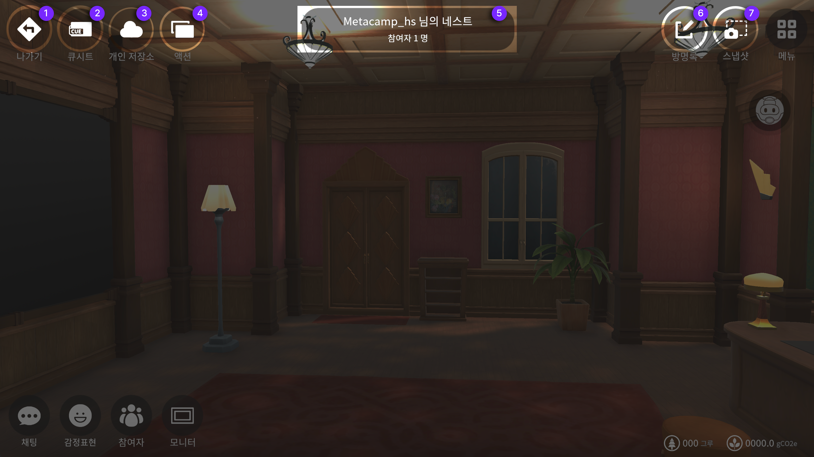
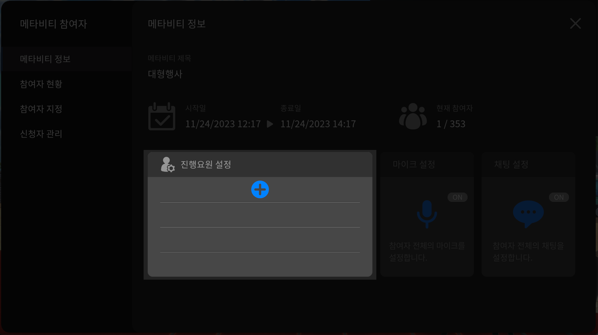

# 메타비티 운영안내

## 메타비티 운영 주의사항&#x20;

* 호스트 권한이 있는 회원은 메타비티를 만들 수 있습니다.&#x20;
* 메타비티는 광장과 행성 광장에서 만들 수 있습니다.
* 메타비티는 참여인원과 행사기간을 입력해야 합니다.&#x20;
* 기간이 지나면 메타비티 기능 대부분을 실행할 수 없습니다.
* 메타비티는 참여인원수와 운영기간에 따른 운영비용이 발생합니다. 따라서, 정확한 인원수 및 운영기간설정이 필요합니다. 불필요한 인원설정과 장기간 설정의 경우 불필요한 크래딧을 사용하게 됩니다.&#x20;
* 메타비티 운영은 클라우드 서버 비용이 발생하므로 신중하게 설정해서 사용해주시기 바랍니다.
* 메타비티가 시작하기 전까지는 과금이 발생하지 않습니다.&#x20;
* 메타비티가 시작하게 되면보유한 크래딧이 차감되며, 환불은 되지 않습니다.&#x20;
* 메타비티 시작전에는 크래딧이 차감되었더라도 변동이 생기면 즉시 크래딧이 환불 됩니다.

## 메타비티 운영용 메뉴설명


<mark style="color:blue;">**메타비티의 특성마다 기능이 다르기 때문에  메뉴가 전부 구성되어 있지 않으니 각 항목을 확인 후,**</mark>&#x20;

<mark style="color:blue;">**목적에 맞는 메타비티를 생성해주시면 됩니다**</mark>&#x20;



메타비티를 생성 후에 운영할 수 있는 화면설명입니다.

메타비티를 먼저 생성해주세요 [메타비티 만들기](undefined/)를 참고해주세요


<figure><figcaption>
<mark style="color:blue;"><strong>메타비티의 특성마다 기능이 다르기 때문에 메뉴 구성이 다를 수 있습니다</strong></mark>
</figcaption></figure>

1. **나가기** 메타비티 나가기버튼입니다
2. **큐시트** 메타비티에서 사용할 큐시트 작동 버튼입니다&#x20;
3. **개인저장소** 개인의 저장소에서 내용을 불러 올 수 있는 버튼입니다&#x20;
4. **액션** 해당 메타비티에서 운영할 수 있는 액션리스트 버튼입니다
5. **메타비티** 안내 창 참여자와 진행시간을 확인 할 수 있는 창입니다&#x20;
6. **방명록** 해당 메타비티의 방명록을 확인 할 수 있는 버튼입니다
7. **화면공유** 운영자가 참여자에게 화면공유를 위한 버튼입니다 운영자만 내 디바이스의 화면 및 카메라를 참여자들에게 공유를 할 수 있습니다 ( 웹캠, 디바이스화면공유 가능 ) &#x20;
8. **카메라** 현재 아바타의 위치를 기준으로 작동되지만, 아바타의 시점이 아닌 전체 화면의 시점으로 카메라 뷰를 설정할 수 있는 버튼입니다
9. **스냅샷** 내 환경과 플레이 화면을 촬영 할 때 사용 할 수 있습니다
10. **메뉴** 메뉴창을 볼 수 있습니다
11. **채팅** 현재 위치해 있는 공간의 채팅창입니다
12. **감정표현** 아바타의 모션으로 감정표현이 가능합니다
13. **참여자** 참여자의 현황과 리스트 및 설정이 가능한 버튼입니다&#x20;
14. **모니터** 송출할 내용의 모니터를 기준으로 확대와 판서기능이 가능한 버튼입니다&#x20;
15. **마이크** 해당 메타비티 내에서 소통 할 수 있는 음성용 on/off기능의 버튼입니다&#x20;
16. **이펙트** 해당 메타비티에서 행사 효과를 줄수 있는 리스트를 보여주는 버튼입니다&#x20;

## 메타비티 상세 기능 이용 안내&#x20;

### **액션 내 메뉴 이용안내**&#x20;


파일을 불러올 때, 경로를 잃어버리셨다면 메타비티에서 나간 후 재 접속하시면 경로가 재 셋팅됩니다


**PDF 파일** 파일을 화면에 공유하여 설명할 수 있습니다&#x20;

<figure><figcaption>
PDF 공유화면 입니다 오른쪽 하단 컨트롤러를 사용하실 수 있습니다
</figcaption></figure>

**동영상링크** 유튜브나 비메오의 링크를 복사하여 공유하며 설명할 수 있습니다&#x20;

유튜브 링크 복사 방법&#x20;

비메오 링크 복사방법&#x20;

**음악파일** 메타비티에서 BGM으로 재생할 수 있습니다

**이미지파일** 이미지를 공유하여 설명할 수 있습니다&#x20;

<figure><figcaption>
이미지 공유화면 입니다 오른쪽 하단 컨트롤러를 사용하실 수 있습니다
</figcaption></figure>

**공지사항** 메타비티 내 공지사항을 등록하여 적용할 수 있습니다&#x20;

<figure><figcaption>
공지사항 적용 화면입니다
</figcaption></figure>

**공지사항** **링크** 메타비티 내 공지사항을 링크로 적용하여 화면에 적용할 수 있습니다  이 링크를 사용자들이 복사해서  웹에서나, 공유 시 사용할 수 있습니다&#x20;



**360이미지** 메타비티 내 배경 화면을 360이미지를 적용하여 테마를 바꿀 수 있습니다&#x20;


360이미지는 왼쪽 하단 로컬파일버튼을 사용하여 커스텀이 가능합니다

360이미지 생성형AI를 이용해보세요&#x20;




**3D 오브제** 3D 파일을 화면에 적용하여 참여자에게 시연 할 수 있습니다


3D오브제는 왼쪽 하단 로컬파일버튼을 사용하여 커스텀이 가능합니다

3D오브제를 생성형AI를 이용해 만들어 적용해보세요 <mark style="color:blue;">**flb파일만 업로드 가능합니다**</mark>




## 메타비티 배너 설정

메타비티 내부에는 특성에 맞게 배너를 설정 할 수 있습니다&#x20;


베너 이미지를 적용 하실 경우, 해당하는 베너를 선택 후 이미지사이즈를 확인하시어 제작부탁드립니다&#x20;




1. **메뉴버튼**을 눌러주세요
2. **배너 꾸미기 버튼**을 눌러주세요
3. 원하는 위치의 배너를 눌러주세요 (\*상단의 배너 위치 안내도 참조)
4. **+버튼**을 눌러주세요
5. &#x20;준비한 이미지를 목록에서 찾아주세요
6. **선택 버튼**을 눌러주세요&#x20;
7. 교체주기를 지정해주세요 적용시 해당 지정한 N초 이후에 점멸 후, 배너가 전환됩니다

**\*배너복제 기능** 모든 이미지를 적용하지 않아도 기존에 적용 한 배너를 복제해서 사용 할 수 있습니다&#x20;

## 메타비티 바로가기 링크 복사&#x20;

메타비티 링크를 복사하여 이용자를 초대할 수 있고, 홍보 할 수 있습니다

<figure><figcaption></figcaption></figure>

1. 진입하려는 메타비티를 목록에서 눌러주세요&#x20;
2. 두번째 **바로가기 링크 복사** 버튼을 눌러주세요&#x20;

## 메타비티 참여자 및 발표자 지정하기

메타비티 참여자를 발표자로 지정하면 큐시트 메뉴와 액션메뉴가 활성화 되며, 발표를 진행 할 수 있습니다&#x20;

1. 해당하는 메타비티에 진입해주세요&#x20;
2. 왼쪽 하단 **참여자 버튼**을 눌러주세요
3. 왼쪽 텝중 두번째 **참여자현황 텝**을 눌러주세요 &#x20;
4. 발표자로 지정할 **참여자를 선택**해주세요&#x20;
5. 두번째 메뉴인 **발표자 지정 버튼**을 눌러주세요&#x20;

## 메타비티 VIP 참여자 지정하기


링크를 클릭하면 바로 메타비티 행사장 VIP 좌석에 앉을 수 있습니다 (THERE 프로그램이 설치 되어 있어야 합니다) &#x20;



대형 행사에는 단상에 앉아야하는 VIP를 8석 지정할 수 있습니다&#x20;

VIP는 비회원이라도 바로가기링크를 공유하여 좌석에 앉을 수 있습니다(\* VIP들에게 잊지 말고 좌석링크를 보내주세요)

THERE 진입 후, [탑승장에서 링크 붙여넣는 방법](../../../there/undefined.md#undefined-3)을 통해 접속 할 수도 있습니다&#x20;

행사장 단상으로 입장한 VIP는 좌석을 클릭해서 원하는 좌석에 앉을 수 있습니다

## 메타비티 진행요원 설정

혼자 운영할 수 없는 메타비티라면, 진행요원을 여러명 지정하여 함께 진행 할 수 있습니다&#x20;

진행요원으로 지정하면 큐시트 메뉴와 액션메뉴가 활성화 되며, 메타비티 운영을 함께 진행 할 수 있습니다&#x20;

<figure><figcaption></figcaption></figure>

1. 해당하는 메타비티에 진입해주세요
2. 오른쪽 하단 **참여자 버튼**을 눌러주세요
3. 진행요원 설정 영역의 **+ 버튼**을 눌러주세요.
4. 진행 요원을 선택해주세요 ( 한명씩 선택 가능합니다 / 여러명 선택의 경우, 반복 작업을 진행해주세요 )

## 메타비티 설정하기

메타비티에서 참여자의 채팅과 마이크를 컨트롤 할 수 있습니다

해당하는 **파란색 아이콘을 선택**하여 on/off를 설정해주세요&#x20;

<figure><figcaption></figcaption></figure>
