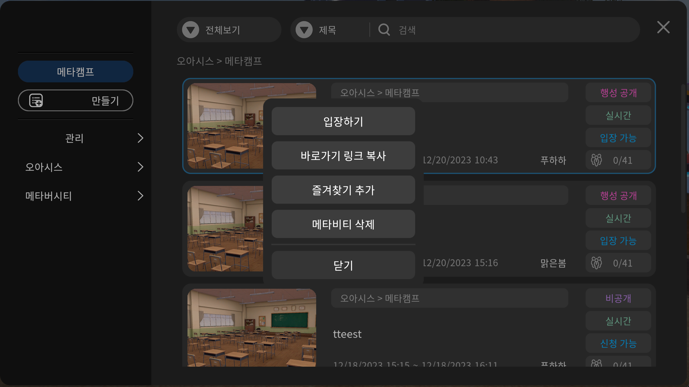

# 스페이스 만들기



1. 왼쪽하단 스페이스 버튼을 눌러주세요
2. 왼쪽상단 스페이스만들기 버튼을 눌러주세요
3. 원하는 스페이스의 형태를 선택해 해당 스페이스를 눌러주세요
4. 스페이스의 제목, 일정, 참여자수 ( 대규모 참여자를 설정할 경우 contect@meta.camp로 문의주세요 ), 항상입장 여부(항상입장으로 설정 시, 스페이스 시작 전에도 입장이 가능합니다)와 공개 여부를 지정해주세요&#x20;
5. 행사장 썸네일 사진도 변경할 수 있습니다&#x20;
6. 시작하기 버튼을 눌러주세요&#x20;
7. 생성 된 스페이스로 진입해주세요&#x20;

***

## 스페이스 유형 (비공개, 행성공개, 전체공개)


스페이스 유형은 메타비티 생성할 때 선택하는데, 한번 선택하면 변경이 불가능 합니다.&#x20;

신중하게 결정해 주세요.


### **비공개** 스페이스

\- 행성 멤버이며 참여자로 지정된 멤버만 참여가 가능합니다

\- 비회원은 참여가 불가능 합니다

\- 출석체크, 참여자 명단 출력이 가능합니다

\- VOD 동영상 강의의 경우 강의 진행률 정보를 확인할 수 있습니다

\- 학교행성에서 진행되는 강의는 비공개 스페이스입니다

\- 비공개 스페이스는 행성관리자도 입장할 수 없습니다

\- 비공개 스페이스는 호스트와 참여자만 입장이 가능합니다

### **행성공개** 스페이스

\- 행성 멤버만 참여할 수 있는 스페이스입니다

\- 비회원은 참여가 불가능 합니다

\- 출석체크는 하지 않지만, 참여자 명단 출력은 가능합니다

\- 멤버 공개로 진행되는 행사에 적합합니다

### **전체공개** 스페이스

\- 비회원, 게스트 모드에서도 참여가 가능한 스페이스입니다.

\- 대외행사, 공개강의 등 누구나 참여할 수 있는 이벤트인 경우게 적합합니다.

\- 행성관리자는 전체공개 스페이스 참석자 현황을 확인할 수 있습니다

\-  비회원인 경우 신원이 확실하지 않습니다

***

## 스페이스 진입 전 나오는 메뉴박스 안내&#x20;

<figure><figcaption></figcaption></figure>

* **입장하기** 선택한 스페이스로 입장할 수 있습니다&#x20;
* **바로가기** **링크 복사** 선택한 스페이스의 링크를 복사하여 초대하고 싶은 사람에게 보낼 수 있습니다&#x20;
* **즐겨찾기** 추가 즐겨찾기로 추가하여 해당 스페이스로 빠른 진입이 가능합니다
* **메타비티** **대시보드** 해당 스페이스의 설정을 변경할 수 있습니다 (\* 스페이스 일정 시작 전에만 가능합니다)
* **메타비티** 삭제 해당 스페이스를 삭제 할 수 있습니다&#x20;
* **닫기** 선택을 잘못한 경우 닫기버튼을 눌러 끌 수 있습니다&#x20;

