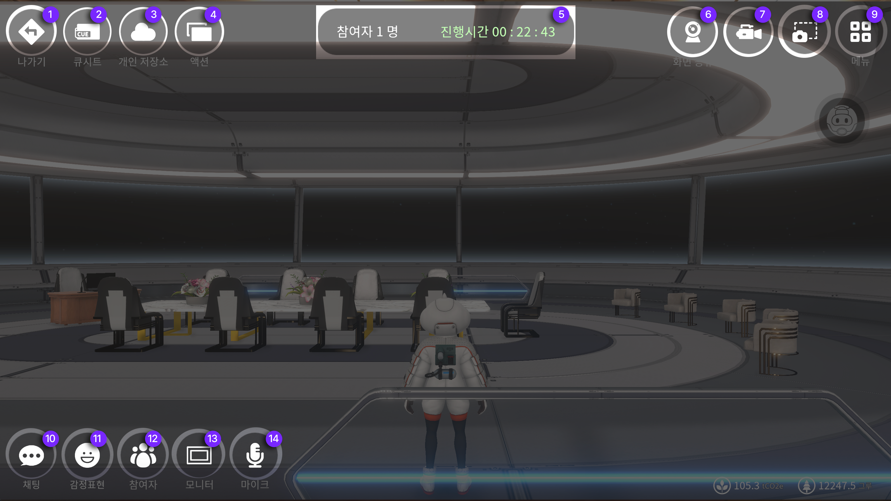

# 동호회 만들기

## 동호회 메뉴 구성&#x20;

<figure><figcaption></figcaption></figure>

1. **나가기** 메타비티 나가기버튼입니다
2. **스냅샷** 내 환경과 플레이 화면을 촬영 할 때 사용 할 수 있습니다
3. **메뉴** 메뉴창을 볼 수 있습니다
4. **채팅** 현재 위치해 있는 공간의 채팅창입니다
5. **감정표현** 아바타의 모션으로 감정표현이 가능합니다
6. **참여자** 참여자의 현황과 리스트 및 설정이 가능한 버튼입니다&#x20;
7. **모니터** 송출할 내용의 모니터를 기준으로 확대와 판서기능이 가능한 버튼입니다&#x20;
8. **마이크** 해당 메타비티 내에서 소통 할 수 있는 음성용 on/off기능의 버튼입니다&#x20;
