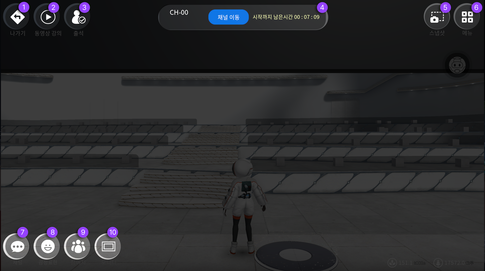

# VOD 강의실 만들기

VOD 동영상 강의실은 동영상을 등록해놓고 참여자가 동영상을 보는 형태의강의실입니다.


동영상 강의실은 강의가 시작되면 참여자는 지속적으로 추가가 가능하지만 추가로 동영상을 등록할 수 없습니다.


## VOD 강의실 메뉴설명

VOD 강의실에서 동작 할 수 있는 기능은 다음과 같습니다

<figure><figcaption></figcaption></figure>

1. **나가기** 메타비티 나가기버튼입니다
2. **동영상** 동영상 강의를 등록하고 수정할 수 있는 버튼입니다
3. **이용창** 해당 공간의 이용자 수와 채널을 관리 할 수 있는 창입니다&#x20;
4. **스냅샷** 내 환경과 플레이 화면을 촬영 할 때 사용 할 수 있습니다
5. **메뉴** 메뉴창을 볼 수 있습니다
6. **채팅** 현재 위치해 있는 공간의 채팅창입니다
7. **감정표현** 아바타의 모션으로 감정표현이 가능합니다
8. **참여자** 참여자의 현황과 리스트 및 설정이 가능한 버튼입니다&#x20;
9. **모니터** 송출할 내용의 모니터를 기준으로 확대와 판서기능이 가능한 버튼입니다

***

## VOD 강의 등록하기


**강의 등록 편리하게 이용하는 방법** 개인저장소 오른쪽 상단 + 버튼을 누른 후, 네번째 영상링크를 순서대로 저장하여 사용하시면 향후 LMS 재 등록 시, 편리하게 사용 할 수 있습니다


<figure><figcaption></figcaption></figure>




**동영상강의 제목을 설정하는 경우, 앞에 숫자를 붙여주는 것을 추천드립니다**

동영상 재생 시작이 동일할 경우 정렬 우선 순위는 숫자, 가나다 오름차순 정렬됩니다

해당 정렬 방식은 원하는 시청순서와 다르게 순서가 바뀔 수 있으니&#x20;

먼저 시청해야 되는 영상 순으로 앞에 숫자를 넣어 정렬하는 것을 추천드입니다

\+ ) 총 영상의 숫자가 두 자릿수 일 경우 (0-99개 사이)

제목앞에 001. 002. 형식으로 세자리 숫자로 지정하는 것을 추천드립니다


1. VOD강의실에 입장합니다
2. 왼쪽상단 두번째 **동영상강의 버튼**을 눌러주세요
3. **강의명, 강의url을 입력**해주세요 ( 유튜브 비디오 링크는 사용은 가능하지만 강의용으로 적합하지 않습니다. 비메오 유료계정 동영상 배포 기능을 추천 합니다 )
4. **재생확인** **버튼**을 꼭 눌러주세요 ( 강의추가가 되지 않습니다 )&#x20;
5. **강의추가** **버튼**을 눌러주세요&#x20;

