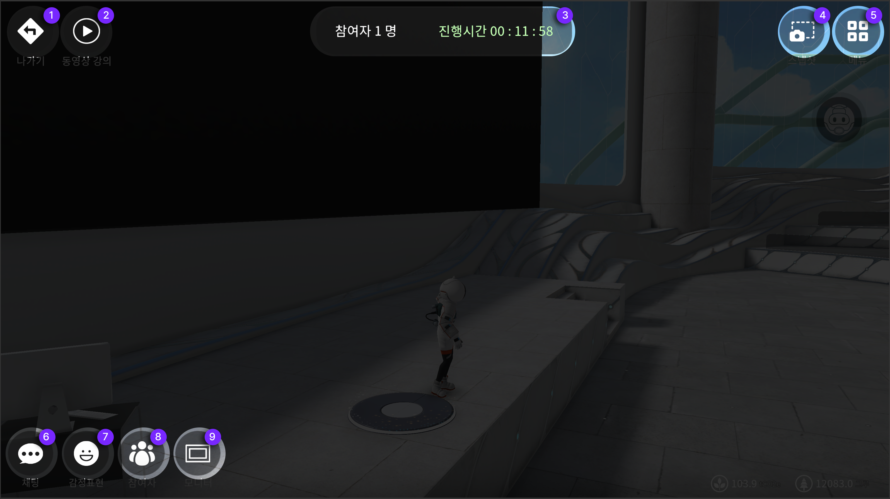

# VOD 강의실 만들기

## VOD 강의실 메뉴설명

VOD 강의실에서 동작 할 수 있는 기능은 다음과 같습니다

<figure><figcaption></figcaption></figure>

1. **나가기** 메타비티 나가기버튼입니다
2. **동영상** 동영상강의를 등록하고 수정할 수 있는 버튼입니다&#x20;
3. **메타비티 안내** 창 참여자와 진행시간을 확인 할 수 있는 창입니다&#x20;
4. **스냅샷** 내 환경과 플레이 화면을 촬영 할 때 사용 할 수 있습니다
5. **메뉴** 메뉴창을 볼 수 있습니다
6. **채팅** 현재 위치해 있는 공간의 채팅창입니다
7. **감정표현** 아바타의 모션으로 감정표현이 가능합니다
8. **참여자** 참여자의 현황과 리스트 및 설정이 가능한 버튼입니다&#x20;
9. **모니터** 송출할 내용의 모니터를 기준으로 확대와 판서기능이 가능한 버튼입니다



## VOD 강의 등록하기

1. VOD강의실에 입장합니다
2. 왼쪽상단 두번째 **동영상강의 버튼**을 눌러주세요
3. **강의명, 강의url을 입력**해주세요&#x20;
4. **재생확인** **버튼**을 꼭 눌러주세요 ( 강의추가가 되지 않습니다 )&#x20;
5. **강의추가** **버튼**을 눌러주세요&#x20;
