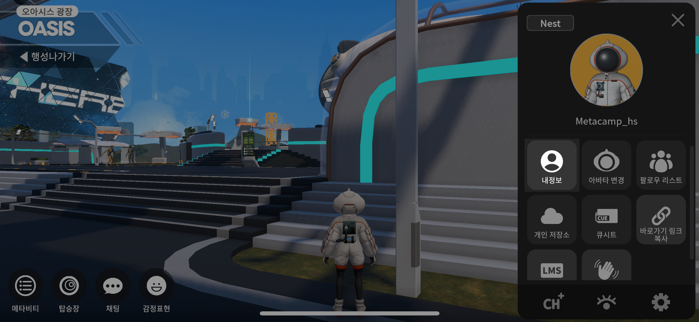

# 사용자 설정

<figure><figcaption></figcaption></figure>

## 내정보 수정하기

<figure><figcaption></figcaption></figure>

1. 메뉴버튼을 눌러주세요
2. 내정보 버튼을 눌러주세요

<figure><figcaption></figcaption></figure>

3\. 변경하고자 하는 항목의 변경버튼을 눌러주세요

4. 입력 후, 활성화 된 변경 버튼을 눌러주세요

**추가정보 수정하기도 동일 한 방식으로 수정하시면 됩니다**

## 아바타변경

<figure><figcaption></figcaption></figure>

1. 원하는 아바타를 선택합니다
2. 아바타 변경버튼을 꼭 눌러주세요

## 팔로우 리스트 관리

<figure><figcaption></figcaption></figure>

친구를 추가하고, 그룹화 하여 관리할 수 있습니다&#x20;

친구와 귓속말을 하고 내가 있는 공간으로 초대할 수도 있습니다&#x20;

