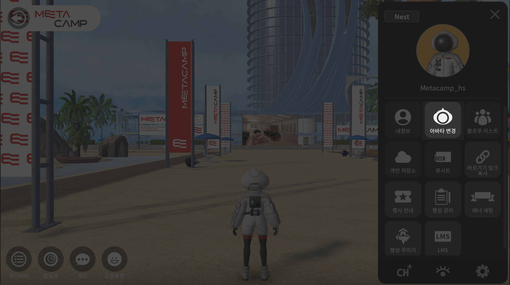

# 사용자 설정

<figure><figcaption></figcaption></figure>

## 내정보 수정하기

<figure><figcaption></figcaption></figure>

1. <mark style="color:blue;">**메뉴버튼**</mark>을 눌러주세요
2. <mark style="color:blue;">**내정보 버튼**</mark>을 눌러주세요

<figure><figcaption></figcaption></figure>

3\. 변경하고자 하는 항목의 <mark style="color:blue;">**변경버튼**</mark>을 눌러주세요

4. 입력 후, 활성화 된 <mark style="color:blue;">**변경 버튼**</mark>을 눌러주세요

## **추가정보 수정하기**


사이트와 SNS의 전체 url을 기재해주세요&#x20;

예시)

[https://there.space\
](https://www.there.spacehttps/www.instagram.com/there\_space)[https://instagram.com/there\_space](https://www.there.spacehttps/www.instagram.com/there\_space)

https://blog.naver.com/there\_spce


1. <mark style="color:blue;">**메뉴버튼**</mark>을 눌러주세요
2. <mark style="color:blue;">**내정보 버튼**</mark>을 눌러주세요
3. 왼쪽의 <mark style="color:blue;">**추가정보 탭**</mark>을 눌러주세요
4. 변경하고자 하는 항목의 <mark style="color:blue;">**변경버튼**</mark>을 눌러주세요
5. 입력 후, <mark style="color:blue;">**Enter키**</mark>를 눌러 변경해주세요

## 아바타변경

<figure><figcaption></figcaption></figure>

<figure><figcaption></figcaption></figure>

1. 메뉴에서 아바타 변경 선택해주세요
2. 원하는 아바타를 선택합니다
3. 아바타 변경버튼을 꼭 눌러주세요

## 팔로우 리스트 관리

<figure><figcaption></figcaption></figure>

<figure><figcaption></figcaption></figure>

1. 메뉴 > 팔로우 리스트 버튼을 눌러주세요&#x20;
2. 친구를 추가하고, 그룹화 하여 관리할 수 있으며 귓속말을 전달하고 내가 있는 공간으로 초대할 수도 있습니다&#x20;

