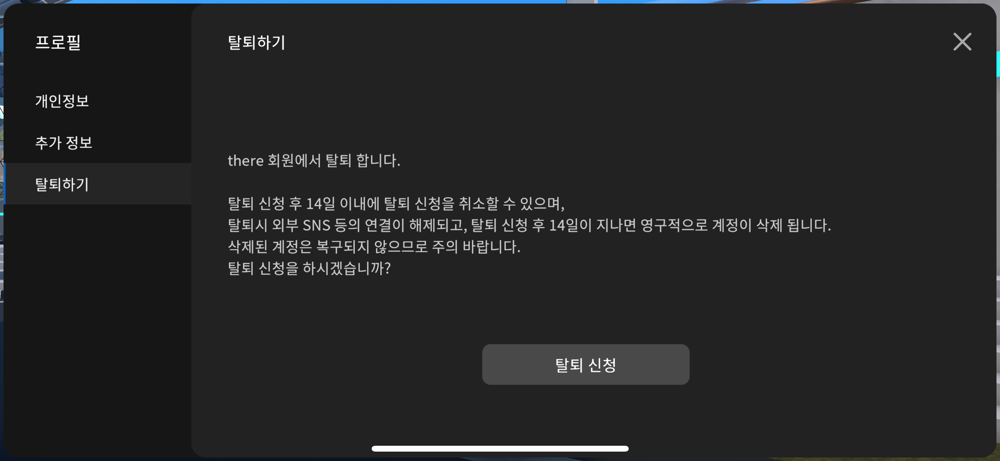

# 회원탈퇴 하기


탈퇴 신청 후 14일 이내에 탈퇴 신청을 취소 할 수 있습니다&#x20;

탈퇴 시 외부 SNS 등의 연결이 해제됩니다&#x20;

탈퇴 후 14일이 지나면 영구적으로 계정이 삭제됩니다&#x20;

삭제 된 계정은 복구되지 않으니 신중하게 결정해주세요&#x20;


<figure><figcaption></figcaption></figure>

1. 행성 어디든 행성내부에 진입해주세요
2. 오른쪽 상단 <mark style="color:blue;">**메뉴버튼**</mark>을 눌러주세요
3. <mark style="color:blue;">**내정보**</mark>를 눌러주세요
4.  왼쪽 탭에서 <mark style="color:blue;">**탈퇴하기**</mark> 버튼을 눌러주세요&#x20;

    <figure><figcaption></figcaption></figure>
5. <mark style="color:blue;">**탈퇴신청**</mark>을 눌러주세요

